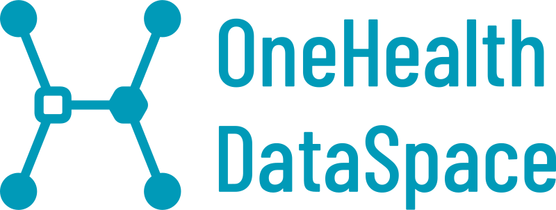

# Documentación y soporte para usuarios del OneHealth DataSpace

En esta sección se recopilarán manuales de usuario, guías técnicas y otra documentación de apoyo relacionada con el uso del espacio de datos.

A diferencia de un espacio de datos convencional, el OneHealth DataSpace integra capacidades avanzadas del CESGA en HPC, Big Data, Cloud, IA, GPU y computación cuántica para ampliar las posibilidades de procesamiento y explotación de datos.

El objetivo de esta guía es proporcionar a los usuarios información clara y accesible para facilitar:

- El acceso a la infraestructura y servicios disponibles.
- La configuración de entornos de trabajo.
- El uso de herramientas y recursos computacionales.
- La ejecución de pruebas y trabajos.
- La resolución de incidencias frecuentes.
- Las buenas prácticas de uso del sistema.

La documentación irá ampliándose progresivamente a medida que se incorporen nuevos servicios, herramientas y casos de uso al espacio de datos.
